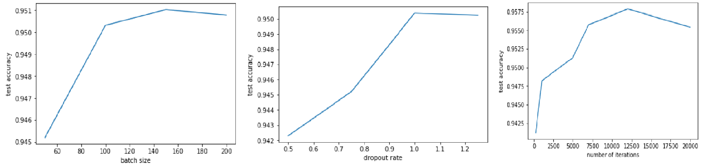

# Facial attribute analysis using convolutional neural networks

Datasets used : CelebA dataset.

In this project a convolutional neural network is trained to identify whether a person in the image is wearing glasses or not.

EVALUATION:

The classification error rate= 0.04896

Results:

Training Accuracy: 0.980

Testing Accuracy: 0.951034

Plots:

