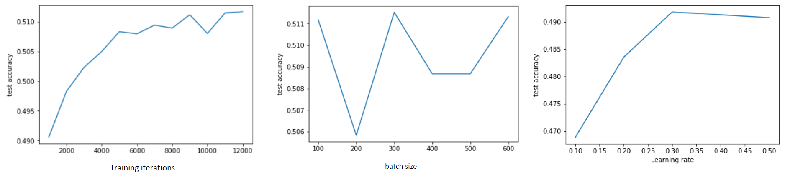
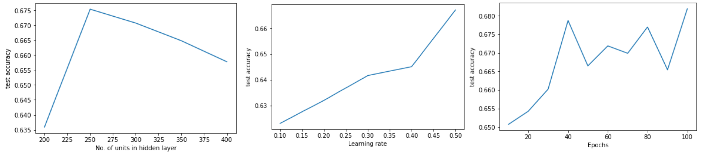

# Handwritten digits recognition

Datasets used : MNIST and USPS handwritten digits.

In this project handwritten digits of MNIST and USPS are classified with three different models.

Models implemented: Logistic regression, Multilayer Perceptron with one hidden layer and COnvolutional Neural network.

Results:

Logistic Regression train accuracy: 0.953109

Logistic Regression test accuracy(MNIST):0.941236

Logistic Regression test accuracy(USPS):0.670626

Mlp with one hidden layer train accuracy:0.9964

Mlp with one hidden layer test accuracy(MNIST):0.9823

Mlp with one hidden layer test accuracy(USPS):0.760134

CNN train accuracy:0.978845

CNN test accuracy(MNIST):0.972114

CNN test accuracy(USPS):0.812316

Plots:

Logistic Regression (USPS):

Multilayer Perceptron with one hidden layer (USPS):

